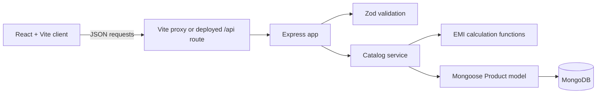

# PayFlex

> Smart products. Flexible payments.

PayFlex is a full-stack product catalogue and EMI selection experience created for the 1Fi SDE1 assignment. It demonstrates product discovery, product detail pages, variant selection, server-calculated pricing and EMI plans, and a demo checkout-intent flow backed by MongoDB.

The repository contains a React/Vite frontend and a TypeScript/Express API. Product data is read from MongoDB through Mongoose rather than being hardcoded in the UI.

## Overview

The application supports:

- Browsing a seeded catalogue of 25 products across 8 categories.
- Filtering by category and searching by product name, brand, or category.
- Opening products through unique slug URLs such as `/products/iphone-17-pro`.
- Selecting product variants such as colour, storage, finish, and inventory-backed availability.
- Recalculating EMI plans for the selected variant on the server.
- Selecting an EMI plan and reviewing a demo checkout confirmation.
- Loading, empty, error, and not-found states in the client.

The checkout flow is intentionally demonstrative. It validates the product, variant, active EMI plan, and inventory, then returns a UUID-based intent. It does not create a payment, credit application, order record, or inventory mutation.

## Preview

The repository includes product and brand assets under [`public/`](public/), but it does not include application screenshots.

## Live Demo

https://pay-flex.vercel.app/


## Features

- Dynamic MongoDB-backed product catalogue
- Product detail pages with slug or MongoDB ObjectId lookup
- Category filtering and text search
- Variant selection with price adjustments and inventory
- Product image, specifications, rating, review, seller, and policy data
- Zero-interest and interest-bearing EMI plans
- Server-side EMI recalculation using the selected variant price
- Cashback and processing-fee information
- Accessible EMI plan selection using radio controls
- Demo checkout-intent validation
- Responsive React UI with Tailwind CSS
- Loading, empty, error, and not-found states
- API and UI tests with Vitest, Testing Library, and Supertest

## Tech Stack

| Layer | Technology |
| --- | --- |
| Frontend | React 19, React Router 7, Vite |
| Styling | Tailwind CSS 3, PostCSS, Autoprefixer |
| Backend | Node.js, Express 5 |
| Language | TypeScript |
| Database | MongoDB or MongoDB Atlas |
| ODM | Mongoose 9 |
| Validation | Zod 4 |
| Icons | Lucide React |
| Testing | Vitest, Testing Library, JSDOM, Supertest |
| Deployment configuration | Vercel (`vercel.json`) |

## Architecture



- **Frontend:** [`src/client/`](src/client/) renders the catalogue, product route, variant controls, EMI selector, checkout modal, and UI states. [`src/client/lib/api.ts`](src/client/lib/api.ts) sends requests using the shared response envelope.
- **API layer:** [`server/app.ts`](server/app.ts) creates the Express app, configures CORS and JSON parsing, applies rate limits, validates requests, and formats errors.
- **Business logic:** [`server/catalog-service.ts`](server/catalog-service.ts) reads products, computes variant prices, filters active plans, calculates EMI values, and validates checkout selections.
- **Database layer:** [`server/models/product.ts`](server/models/product.ts) defines one `Product` document with embedded variants, EMI plans, specifications, ratings, reviews, and policies. [`server/lib/mongoose.ts`](server/lib/mongoose.ts) manages the MongoDB connection.
- **Shared logic:** [`src/shared/emi.ts`](src/shared/emi.ts) contains the EMI and total-payable calculations used by the API.

## Project Structure

```text
api/index.ts                 Vercel serverless API entry point
public/products/             Product image assets
server/app.ts                Express app, routes, validation, rate limits
server/catalog-service.ts    MongoDB-backed catalogue and checkout logic
server/models/product.ts     Mongoose Product schema and embedded subdocuments
server/seed.ts               Seed data and database population script
src/client/                  React application, pages, components, and API client
src/shared/                  Shared DTOs and EMI calculations
```

## Data Model

The database stores a `Product` document with embedded subdocuments. Variants and EMI plans are not separate collections.

### Product

| Field | Type | Notes |
| --- | --- | --- |
| `slug` | String | Required and unique product URL identifier |
| `name`, `brand`, `description` | String | Product display data |
| `badge` | String or null | Optional catalogue badge |
| `category` | String | Catalogue category |
| `basePrice`, `mrp` | Number | Prices in the seeded INR data |
| `sellerName` | String | Seller display name |
| `variants` | Embedded documents | Colour, storage, finish, image, adjustment, inventory |
| `emiPlans` | Embedded documents | Tenure, annual rate, cashback, fee, active flag |
| `specifications` | Embedded documents | Label/value pairs |
| `rating` | Embedded document | Aggregate and distribution data |
| `reviews`, `policies` | Embedded documents | Product detail content |
| `createdAt`, `updatedAt` | Date | Mongoose timestamps |

The seed data contains 25 products, each with multiple variants and seven active EMI plans for 3, 6, 9, 12, 18, 24, and 36 months. The 36-month plan uses a 10.5% annual interest rate; the shorter seeded plans use 0% interest. The exact product values are defined in [`server/seed.ts`](server/seed.ts).

## EMI Calculation

The API calculates plans from the selected variant price:

```text
selected price = basePrice + variant.priceAdjustment
```

For 0% interest:

```text
monthly payment = round(principal / tenure months)
```

For interest-bearing plans, the implementation uses reducing-balance EMI:

```text
r = annual interest rate / 12 / 100
EMI = P * r * (1 + r)^n / ((1 + r)^n - 1)
```

Monthly payment is rounded to the nearest whole number. Total payable is the rounded monthly payment multiplied by the tenure, plus the processing fee. The implementation is in [`src/shared/emi.ts`](src/shared/emi.ts).

## API

The API returns either `{ "success": true, "data": ... }` or `{ "success": false, "error": ... }`. In the Express app, routes are available under `/api` and are also mounted at the root for deployment compatibility.

### `GET /api/health`

Returns the API health status:

```json
{ "success": true, "data": { "status": "ok" } }
```

### `GET /api/products`

Lists products. Optional query parameters:

- `category`: exact category filter, with `Mobiles` also matching `Smartphones` and `Deals` selecting products with a discount or badge.
- `q`: case-insensitive search across product name, brand, and category.

Each summary includes `id`, `slug`, product identity, `price`, `mrp`, `imageUrl`, `startingMonthlyPayment`, `hasZeroInterest`, `variantCount`, `sellerName`, and rating data.

### `GET /api/products/:slug`

Returns a complete product by slug or valid MongoDB ObjectId. The response includes variants with computed prices, active EMI plans, specifications, ratings, reviews, policies, and seller information.

### `GET /api/products/:slug/emi-plans?variantId=:variantId`

Returns active plans recalculated for a selected variant. If `variantId` is omitted, the first variant is used. Invalid product, variant, or request values return an error envelope.

### `POST /api/checkout/intent`

Validates a demo purchase selection.

```json
{
  "productSlug": "iphone-17-pro",
  "variantId": "<variant ObjectId>",
  "emiPlanId": "<active EMI plan ObjectId>"
}
```

On success, the API returns status `201` with an intent ID, selected product and variant, price, computed plan, and the disclaimer that no payment or credit application is created.

### API safeguards

- Zod validates slugs, ObjectIds, query parameters, and checkout payloads.
- API requests are limited to 100 requests per 15-minute window per IP.
- Checkout requests are limited to 10 attempts per minute per IP.
- JSON request bodies are limited to 20 KB.
- CORS origins are controlled by `CLIENT_ORIGIN`.

## Getting Started

### Prerequisites

- Node.js with npm
- A running MongoDB instance or MongoDB Atlas connection string

### Install

```bash
npm install
```

Copy the example environment file:

```bash
# macOS/Linux
cp .env.example .env

# Windows PowerShell
Copy-Item .env.example .env
```

Then set the values for your environment:

```env
DATABASE_URL="mongodb://localhost:27017/payflex"
PORT=4000
CLIENT_ORIGIN="http://localhost:5173"
VITE_API_URL=""
```

`DATABASE_URL` defaults to the local MongoDB URI above when omitted. `VITE_API_URL` is optional; leave it empty during local development so Vite proxies `/api` to `http://localhost:4000`.

### Seed the database

```bash
npm run db:seed
```

The script connects to `DATABASE_URL`, clears the `Product` collection, inserts the seed catalogue, and disconnects.

### Run locally

```bash
npm run dev
```

- Frontend: `http://localhost:5173`
- API: `http://localhost:4000`

The combined development command starts Vite and the TypeScript Express server concurrently.

## Scripts

| Command | Purpose |
| --- | --- |
| `npm run dev` | Start frontend and API in watch mode |
| `npm run dev:web` | Start Vite only |
| `npm run dev:api` | Start the API with `tsx watch` |
| `npm run build` | Build API and frontend |
| `npm run build:web` | Type-check and build the Vite client into `dist/client` |
| `npm run build:api` | Compile the server using `tsconfig.server.json` |
| `npm start` | Run the compiled server from `dist/server/server/index.js` |
| `npm run db:seed` | Replace the Product collection with seed data |
| `npm test` | Run the Vitest suite once |
| `npm run test:watch` | Run Vitest in watch mode |
| `npm run lint` | Run ESLint with zero warnings allowed |

## Testing

Tests currently cover:

- EMI calculations and validation in [`src/shared/emi.test.ts`](src/shared/emi.test.ts)
- EMI plan selection in [`src/client/components/EmiSelector.test.tsx`](src/client/components/EmiSelector.test.tsx)
- Product experience and demo checkout behavior in [`src/client/components/ProductExperience.test.tsx`](src/client/components/ProductExperience.test.tsx)
- API routing, validation, and checkout intent behavior in [`server/app.test.ts`](server/app.test.ts)

Run the checks with:

```bash
npm test
npm run build
npm run lint
```

These are automated unit and integration-style tests; the repository does not claim end-to-end browser coverage or MongoDB integration-test coverage.

## Deployment Configuration

[`vercel.json`](vercel.json) configures:

- `npm run build:web` as the Vercel build command.
- `dist/client` as the static output directory.
- `/api/*` requests to be rewritten to [`api/index.ts`](api/index.ts).
- Non-API frontend paths to be rewritten to `index.html` for client-side routing.

A deployed environment still needs a reachable MongoDB database and the appropriate environment variables configured in the hosting provider.

## Known Notes

- The checkout endpoint is a validation and confirmation demo, not a real payment workflow.
- Seed image URLs include both raster and SVG paths. Before a production demo, verify that every seeded URL matches an asset in [`public/products/`](public/products/).
- No public demo URL or application screenshots are committed, so neither is linked here.

## Assignment Scope

This project demonstrates the requested full-stack concepts: dynamic product data, product pricing and images, multiple variants, multiple EMI plans, selectable plans, a proceed flow, REST APIs, MongoDB persistence, a Mongoose schema, seed data, unique product URLs, and local setup documentation.
